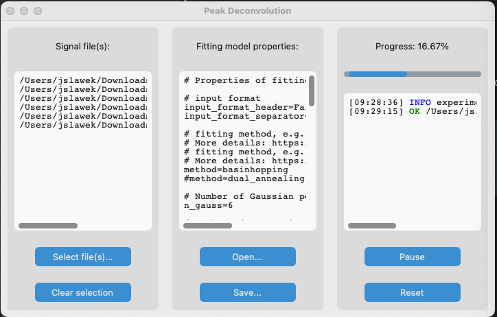
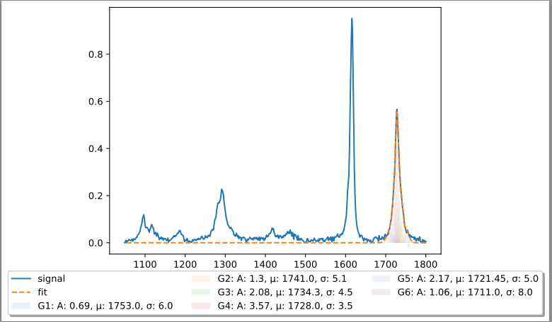

# Deconvolution
This is a Python program to deconvolve peaks from a signal. It has a simple user interface to load signal
files, control deconvolution parameters, and track progress:



It uses [Non-Linear Least-Squares Minimization and Curve-Fitting](https://lmfit.github.io//lmfit-py/),
and produces results as text files and pdf figures, e.g.:



## Requirements

This program uses [CustomTkinter](https://customtkinter.tomschimansky.com/) to create a user interface. On MacOS you
may need to install additional libraries, i.e.:
```commandline
brew install python-tk
```

I haven't tried it on Windows or Linux. All additional requirements are listed in `requirements.txt` file:

```commandline
 % cat requirements.txt 
customtkinter
lmfit
matplotlib
pandas
jproperties
```

## Development

The easiest way to run and develop this project is by resolving dependencies and running the program:
```commandline
% pip install -r requirements.txt
% python src/main.py
```

Happy Deconvolving!